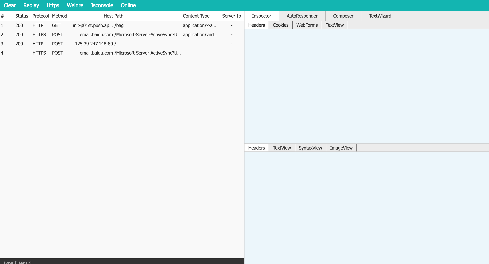

# idevt

## Feature

- Capture request/resonse

- Filter request url

- Syntax highlighting the response body

- Image response preview

- Support HTTP/HTTPS

- Modify response directly

- Custom autoResponder Rule(import/export rulelist)

- Textwizard

## Usage

    npm i idevt -g

## Commands

### start debug

    idev start
    // or specify specific port
    idev start -p yourport

### log help info

    idev help

### log version

    idev -V

## WebUI

## Todo

- support weiner/jsconsole

- clear 304 cache

- replay request

- support composer

## Refer

- [Mixu's Node book](http://book.mixu.net/node/ch10.html)
