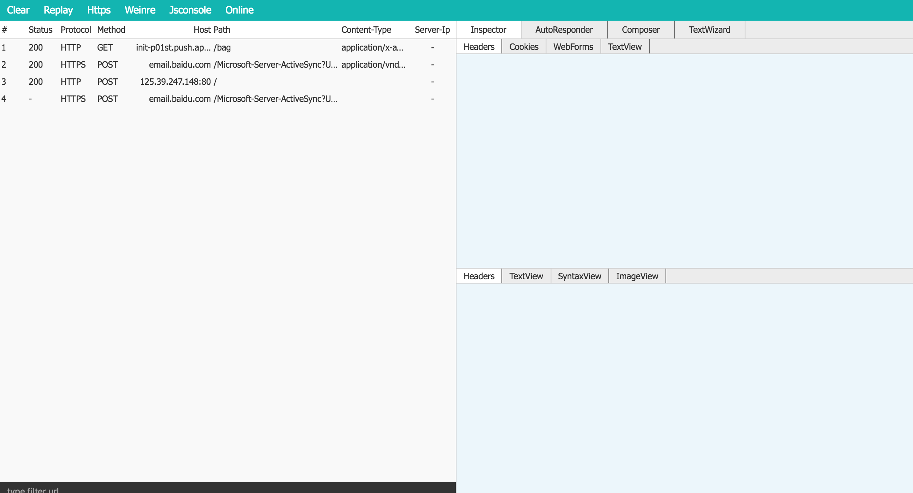

# idev

A Web Debugger Proxy Like Fiddler

## Usage

    npm i idev -g

## Commands

1、start debug

    idev start

    // Or

    idev start -p yourport

2、log help info

    idev help

3、log version

    idev -V

## UI

## Todo

- weiner/jsconsole

- clear cache

## Refer

- [Mixu's Node book](http://book.mixu.net/node/ch10.html)
