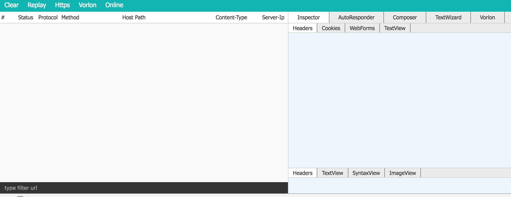

# idevt

A Web Debugger Proxy Like Fiddler.

## Features

- Capture request/response

- Filter request url

- Syntax highlighting the response body

- Image response preview

- Support HTTP/HTTPS

- Support Vorlon

- Modify response directly

- Custom autoresponder rule(import/export rulelist)

- Textwizard

## Install

    npm i idevt -g

## Commands

    // start debug
    idev start

    // or specify specific port
    idev start -p yourport

    // log help info
    idev -h

    // log version
    idev -V

## WebUI

## Todos

- clear 304 cache

- replay request

- support composer

## Refer

- [Mixu's Node book](http://book.mixu.net/node/ch10.html)
